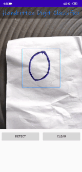

# Handwritten Digit Clasifier

Handwritten Digit Clasiifier is an android app that is used to classify handwritten digit. It uses a CNN model trained on [MNIST dataset](http://yann.lecun.com/exdb/mnist/) to classify. The accuracy of the model was 98.40%. Download the [apk](android/apk/handwritten_digit_classifier.apk) of the app from apk folder.

## DEMO

      

## PRE-REQUISITES
* [python 3.7.7](https://www.python.org/downloads/)
* [jupyter notebook](https://jupyter.org/install)
* [keras](https://www.tensorflow.org/api_docs/python/tf/keras)
* [tensorflow lite](https://www.tensorflow.org/lite)
* [android studio 3.6.1](https://developer.android.com/studio)
* [opencv for android](https://sourceforge.net/projects/opencvlibrary/files/opencv-android/)

## Usage
After cloning this repo just follow these steps:
### a) Model training
Run the [cnn_mnsit.ipynb](model/cnn_mnist.ipynb) to train and save the model.
### b) Conversion to tflite format
The [saved model](model/mnist_cnn.h5) cannot be directly used in android apps. Firstly, it needs to be optimized enough to reside within apps. TensorFlow Lite is the solution to enabling ML models within mobile apps.
Run the [mnist_tflite.ipynb](model/mnist_tflite.ipynb) to convert the saved model to tflite format.
### c) Run the android app
Import the [android](android) part of the project in android studio and then run the app.
## Credits
* [Tensorflow lite tutorial](https://www.tensorflow.org/lite/tutorials)
* [Opencv setup on android studio](https://android.jlelse.eu/a-beginners-guide-to-setting-up-opencv-android-library-on-android-studio-19794e220f3c)
